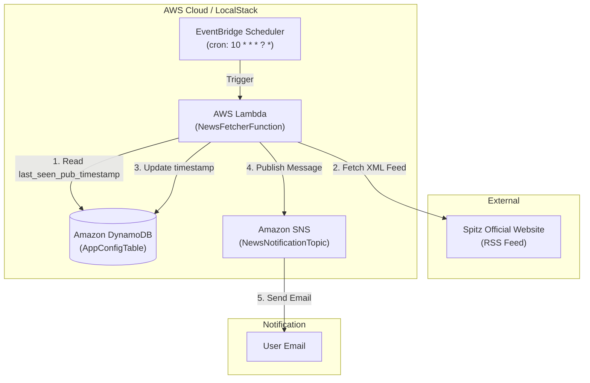

# アーキテクチャ設計書

本ドキュメントでは、`spitz-news-mikke` のシステム構造、データフロー、および設計判断について詳述します。

## システム構成図

## コンポーネント設計

### 1. 状態管理 (DynamoDB)
- **テーブル名**: `news-fetcher-app-settings` (論理名: `AppConfigTable`)
- **キー構造**:
    - `setting_key` (Partition Key): `last_seen_pub_timestamp` 固定
- **保持データ**: 最後に通知を送信した記事の `pubDate`（UNIXタイムスタンプ）。
- **設計意図**: ステートレスな Lambda で「既読」を判定するため、外部ストレージとして軽量かつ高速な DynamoDB を採用。

### 2. ビジネスロジック (Lambda)
- **ランタイム**: Python 3.12
- **主要ライブラリ**: `feedparser` (RSS/Atom パース), `boto3` (AWS SDK)
- **処理シーケンス**:
    1. 前回のタイムスタンプを取得。存在しない場合は `0` として扱う。
    2. フィードを取得し、公開日時（`published_parsed`）が保持しているタイムスタンプより新しい記事をフィルタリング。
    3. 新着記事がある場合、最新記事のタイムスタンプで DynamoDB を更新。
    4. SNS 経由で通知メッセージを送信。

### 3. 通知 (SNS)
- **プロトコル**: Email
- **設計意図**: 疎結合なアーキテクチャを維持するため、Lambda から直接メールを送るのではなく、SNS を介して配信。将来的な通知先（Slack, LINE等）の拡張を容易にする。

## データフロー

1. **トリガー**: EventBridge が 毎時10分に Lambda を起動。
2. **比較判定**: `RSS取得データ.pubDate > DynamoDB.timestamp` の条件で新着を判定。
3. **冪等性**: 同じフィードを複数回取得しても、DynamoDB のタイムスタンプが更新済みであれば SNS 通知は飛ばない設計。

## ローカル開発とモック
- **LocalStack**: 本番と同等の AWS API エンドポイントをローカルに構築。
- **環境切り替え**: `AWS_SAM_LOCAL` またはカスタム環境変数により、`boto3.client` 作成時に `endpoint_url` を `http://localhost:4566` に向けるよう制御。
